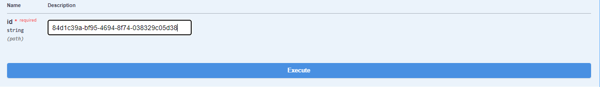
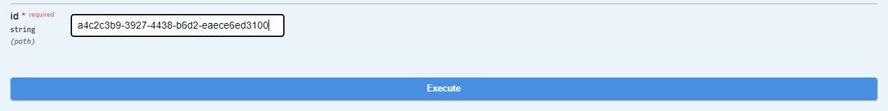

# TP1_MicroServices
## Documentation Swagger "Customer-service"

+ Get Customers
  

+ Get Customer by ID
  
  

+ Add Customer
  
  

## Documentation Swagger "Billing-service"
+ Get Invoices
  
  
+ Get Invoice By ID
  
  
  
+ Get Invoice By Customer ID
  
  
  
+ Add Invoice
  
  
  

## Eureka Service

+ Billing-service
  
 
+ Customers-service
 
